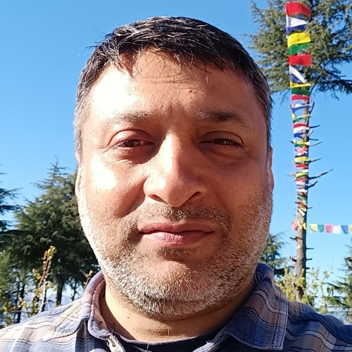
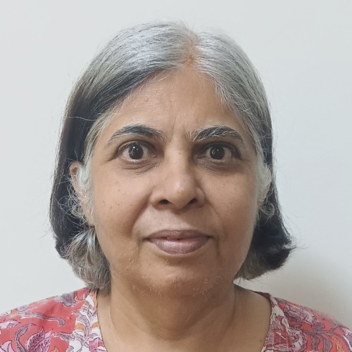

# Faculty members

## Abhay G. Bhatt

Ph.D., Indian Statistical Institute, Delhi

_Areas of interest_ : Markov Processes and martingale problems,
Stochastic Filtering Theory, Stochastic Control

_E Mail_ : abhay [at] isid.ac.in

_Phone_ : +91-4149-3927

_Office Room No_ : 203

* * *

## Arindam Chatterjee

Ph.D., Iowa State University

_Areas of interest_ : Network data, Statistics for high-dimensional data, Resampling methods, Time series.

_E Mail_ : cha (at) isid.ac.in

_Phone_ : +91-4149-3920

_Office Room No_ : 120

* * *

## Isha Dewan

_Areas of interest_ : Competing Risks, Reliabiliy Theory, Nonparamteric Inference

_E Mail_ : isha (at) isid.ac.in

_Phone_ : +91-11-4149-3944

_Office Room No_ : 220

* * *

## Swagata Nandi

Ph.D., Indian Institute of Technology, Kanpur

_Areas of interest_ : Non Linear Regression, Statistical Signal Processing, Surrogate Data, Survival Analysis

_E Mail_ : nandi (at) isid.ac.in

_Phone_ : +91-11-41493931

_Office Room No_ : 207

* * *

## Deepayan Sarkar

Ph.D., University of Wisconsin-Madison

_Areas of interest_ : Statistical Computing, Statistical Graphics, Computational Biology

_E Mail_ : deepayan.sarkar (at) gmail.com, deepayan (at) isid.ac.in

_Phone_ : +91-11-41493937

_Office Room No_ : 213

<!--

* * *

## Soham Sarkar

Ph.D., Indian Statistical Institute, Kolkata

_Areas of interest_ : High-dimensional Data, Functional Data, Statistical Learning

_E Mail_ : sohamsarkar (at) isid.ac.in

_Phone_ : +91-11-4149-3960 

_Office Room No_ : 312 

-->
